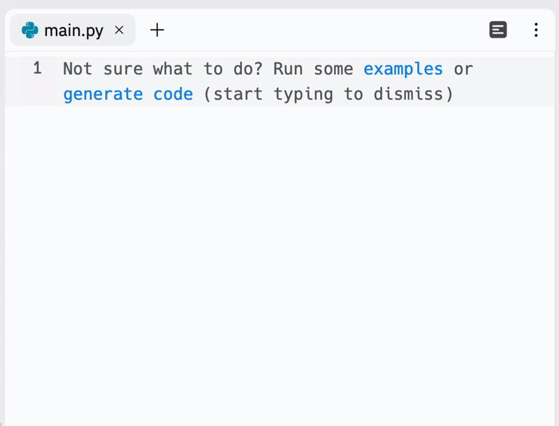
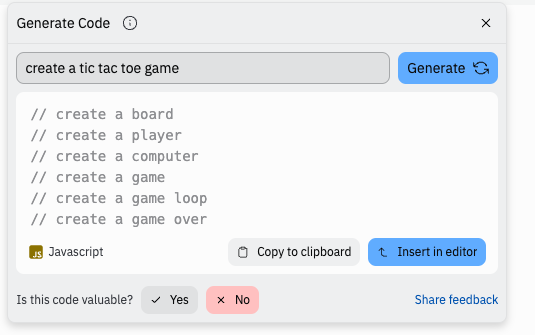

## This README is an introduction to trying out two AI coding tools. 

I want to help put them into context and de-hype them a little bit but recognize their use cases. I have a strong personal opinion these tools are primarily suitable to certain educational environments such as a coding generation AI tool. Basically, I hope this guide helps you find usage of AI versus other methods as part of a balanced diet and toolbelt. 

Products out there I am focusing on:
* Github Copilot (paid, in IDE, $10 a month)
* Replit Ghostwriter (paid, cycle units, in browser, $10 a month)

Why these products?

These two products are broadly representative of what current consumer coding AI tools are like with some organizational strength behind them. This is an "every persons guide" and there is a lot that goes into operationalizing an AI that we don't need to concern ourselves with. Github Copilot is available for a variety of local IDE's and REPLits Ghostwriter is available in a web IDE.

Emerging products/uses **not** the focus of this post:
* chatGPT and synthetic text generative AI’s as coding tools:
    * There have been some attempts at using chatGPT as a coding tool but there are real flaws with it. It can produce some amazing looking attempts at coding but does not seem to follow the same kind of product as CoPilot or Ghostwriter which are trained exclusively on code and samples. It is an emerging field but I won't be focusing on it now. 

* [I am aware of legal issues facing Github Copilot](https://githubcopilotlitigation.com/). This is due to the incompatible licensing of some of the code on GitHub that the model is trained on. This needs to be fixed but I don't think it should stop any individual user from learning about this tool. Seek your own advice before using it for anything commercial.

I think a set of observations has to begin this post:

* They get it wrong. Filtering out what is wrong is an important and vital role of the programmer interacting with an AI coding tool. 

* They get it (sorta) right. Being able to identify whats a roughly correct answer is still the domain of the programmer. Very rarely will an answer go without needing some kind of editing or pruning to work for your intended purpose.

* Sometimes it will give you something you didn't ask for but that you come to find useful anyways.

* Its just a tool. It should not be your only, main or first tool necessarily for different things

## Lets get coding!

# [GitHub Copilot](https://github.com/features/copilot)


1. [Sign up to GitHub](https://github.com/join) && [Copilot](https://github.com/features/copilot)
2. [Install extension in your IDE (I am using VS Code)](https://docs.github.com/en/copilot/getting-started-with-github-copilot/getting-started-with-github-copilot-in-visual-studio-code)
3. Enable globally


## Prompts

### Examples generated with prompts included in `/src` directory

The essence of using Copilot is providing the AI prompts and it will provide a number of possible solutions. It will give suggestions in the text of the IDE for autocompleting prompts and then also show you highlighted potential solutions in the IDE.

However, I strongly reccomend you use Ctrl + Enter for multiple suggestions- this is the real mode you want to use to exercise your brain.

## What makes a good prompt?

Well, it is a little bit of an art form you will work on as you experiment with the tool. Sometimes providing more detail and instructions confuses the AI and sometimes it helps. Sometimes a strong powerful use of keywords can produce some good results.

A simple prompt can just be a comment in the language you are using in the file:

### Example

1. I created a file called "`PageSpeedInsight.jsx`"

2. I entered this comment:

    *   `// Create a React Component that displays pagespeed insights`

3. Hit Ctrl+Enter with my cursor below the comment

Bam! it created for me a complete and almost completely functional with little editing React Component that uses the PageSpeed Insights API! It seems like the few keywords dialed in on the code to synthesize something good.
```
// Create a React Component that displays pagespeed insights

export function ReactComponent({ url }) {
  const [data, setData] = React.useState(null);
  const [error, setError] = React.useState(null);
  const [loading, setLoading] = React.useState(false);

  React.useEffect(() => {
    if (!url) return;

    setLoading(true);

    fetch(`https://www.googleapis.com/pagespeedonline/v5/runPagespeed?url=${url}`)
      .then((response) => response.json())
      .then((data) => {
        setData(data);
        setLoading(false);
      })
      .catch((error) => {
        setError(error);
        setLoading(false);
      });
  }, [url]);

  if (loading) return <p>Loading...</p>;
  if (error) return <p>Error: {error.message}</p>;
  if (!data) return null;

  return (
    <>
      <h2>React Component</h2>
      <p>{data.lighthouseResult.finalUrl}</p>
      <p>{data.lighthouseResult.categories.performance.score * 100}</p>
    </>
  );
}
```
It is possible on a very early initial level to sense how the AI is learning. The name and file type of your file will give the first initial big hint to Copilot what to do when it runs the prompt. The name of the function and content of the comment making the prompt will produce potentially wildly different results with small changes.


## Getting results

Sometimes your prompt will fail to produce any results. Sometimes it will produce output that is a repeated comment of your prompt over and over again. Its simple to just expect this regularly: the AI creates gibberish and unusable code when it seems to be confused. 

Opening the multiple answers side-panel with Ctrl + Enter will show potentially 10 synthesized answers per prompt. The real value out of this tool is seeing what kind of directions the different answers go even if none are suitable for using without a lot of editing- it is just like reading code to study, except there is a degree of interactivity which makes it excellent. 

## Commentary: a balanced diet & limits

The real joy and sweet spot of using this tool is when you get initial feedback from a few prompts that pushes you forward in a direction you were already going. Sometimes it just saves you time doing boilerplate, or repetitive coding. GitHub itself heavily markets this aspect that you "Spend more time doing what you enjoy doing".

On the other side, there is a diminishing return to using Github Copilot for certain uses. Many questions cross domains of knowledge and languages, some rely on context and specific information that only you can easily access. Copilot is just a tool and it produces a lot of junk you need to sift through and often it simply is not worth it until you have studied more.

However, there is also a use for this tool to help you get going when you are struggling. Just having the feedback from the suggested solutions might jog the issue and bring about progress.

> The coding solutions suggested by Copilot are limited by a maximum length and therefore only really used for snippets, rather than generating whole apps or multiple files. 

If you are lacking knowledge with a coding issue or programming issue it won't necessarily be of great help. It will often require specialized knowledge to implement the solutions into practice. For example, some solutions will include references to API keys which you may need to sign up for to be able to attempt to use. 

However, there are emerging features which make this learning feedback loop even more interesting:

## [Github Copilot Labs](https://githubnext.com/projects/copilot-labs/)

Github Copilot Labs is a VS Code extension for experimental applications of GitHub Copilot.

This extension currently at time of writing provides multiple machine learning powered applications related to copilot including:

* Ability to explain code by entering a code snippet
* Language translation, porting solutions from one language to another
* "Brushes" - features such as adding Types, making code more readable, and documentation

I have only barely experimented with these so I will leave here, just to say that they exist and are interesting to try.


# [Ghostwriter: AI in the web IDE](https://replit.com/site/ghostwriter)



I have enjoyed using REPLit as an educational resource and web IDE. So I was curious when I heard they were launching their own AI called Ghostwriter what that would be like.

Like Github Copilot, Ghostwriter is a premium feature for $10 a month using the platforms cycles units. 

What strikes me as a point of difference is the ability to quickly generate code in a live web environment and see the results, potentially on many devices. From initial experimentation, there seems to be more of a focus or capability for CSS snippets and HTML that appeals to me.

The following is a HTML page I created by running two generate prompts and inserting the output into the editor:

* Create a table of Presidents of the USA
* Create a Tic Tac Toe Board with CSS Grid


Like that, I was able to start to style and populate my little web app.

However, pretty quickly, I was reminded that the AI gets confused and loves to bring you comments when it doesn't know what else to do:




Overall, an interesting way to potentially spend $10. If you are coding on browsers for convenience, and especially if you are trying out [mobile coding on a phone](https://replit.com/mobile) for some reason, REPLit is the way to go. 

# Conclusions

As discussed, both of these tools have potential use cases. It is a little bit of an art and process to learn how to adapt to using the tools. Sometimes they amaze me. Sometimes it produces nothing of value. 

Programmers as creative knowledge workers and human beings will always have a role. I would encourage you to think of these AI tools as part of a balanced diet, a small part of your toolset. 